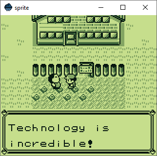

# sprite
A Game Boy emulator written in [drizzle](https://github.com/jsmolka/drizzle).

## Why
This emulator serves as the ultimate stress test for my programming language. It implements most components of the system with reasonable accuracy. There is no sound, no saves, and the cartridge types are limited to MBC0, MBC1, and MBC3. The performance is quite poor. The emulator runs at 45%. There is an [optimized version on another branch](https://github.com/jsmolka/sprite/blob/optimize/sprite.dz) that reaches 66%.

## Usage
Download the latest version of [drizzle-sdl](https://github.com/jsmolka/drizzle/releases) for your system and run `drizzle sprite.dz <rom>`.

## Binaries
Binaries for Windows, Linux and macOS are available as [nightly](https://nightly.link/jsmolka/sprite/workflows/build/master) and [release](https://github.com/jsmolka/sprite/releases) builds.

## Build
Detailed build instructions can be found [here](BUILD.md).

